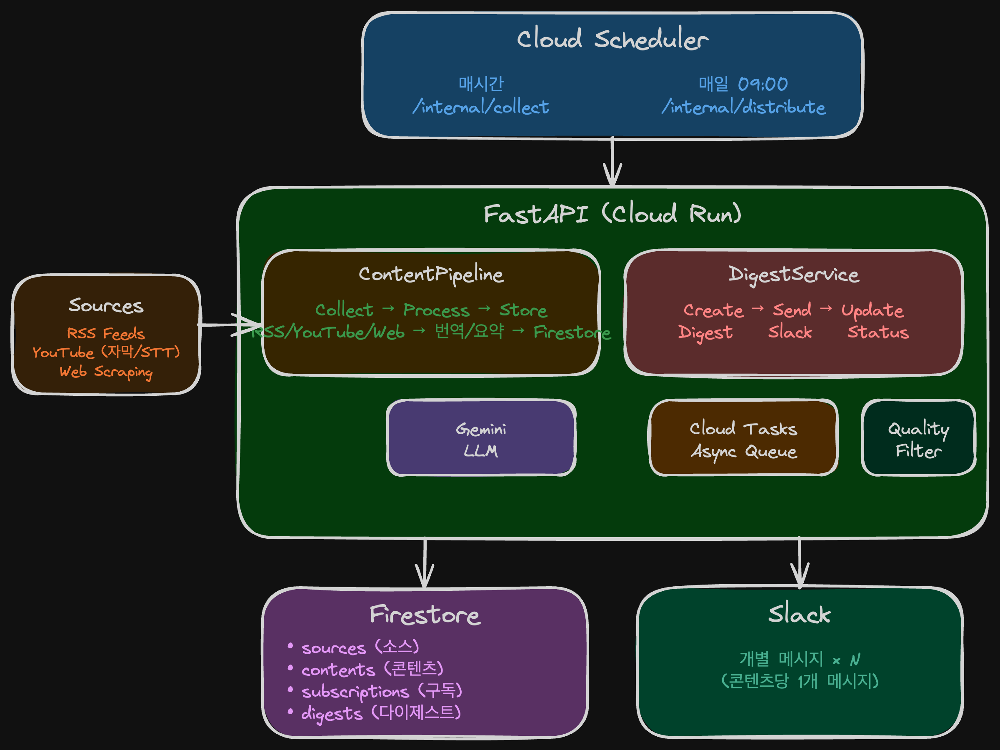

# AX Content Hub

AX(AI Transformation) 콘텐츠를 큐레이션하여 슬랙으로 전달하는 봇입니다.

## 핵심 가치

"읽어야 할 것"이 아니라 "이미 정리된 것"을 받는 경험

## 주요 기능

- **수집**: RSS 피드, YouTube 자막/음성인식(STT), 웹 스크래핑 (4단계 폴백)
- **처리**: 영→한 번역, GeekNews 스타일 요약, AX 관련성 스코어링
- **배포**: 슬랙 다이제스트 발송
- **품질 필터링**: 관련성/카테고리/시간 기반 콘텐츠 필터링

## 아키텍처

### 시스템 개요



### 데이터 흐름

| 단계 | 주기 | 설명 |
|------|------|------|
| **1. 수집** | 매시간 | RSS/YouTube → Content 생성 → Firestore 저장 |
| **2. 처리** | 수집 직후 | Content(원문) → 번역 → 요약 → 스코어링 (Gemini) |
| **3. 배포** | 매일 09:00 | 구독별 콘텐츠 조회 → 다이제스트 생성 → Slack 발송×N |

### 스케줄

| 작업 | 주기 | 엔드포인트 | 설명 |
|------|------|-----------|------|
| 수집 | 매시간 | `POST /api/internal/collect` | 활성 소스에서 새 콘텐츠 수집 및 처리 |
| 발송 | 매일 09:00 KST | `POST /api/internal/distribute` | 구독별 다이제스트 생성 및 Slack 발송 |

### 멱등성 키

| 엔티티 | 키 형식 | 예시 |
|--------|---------|------|
| Content | `{source_id}:{sha256(normalized_url)}` | `src_001:a1b2c3d4...` |
| Digest | `{subscription_id}:{YYYY-MM-DD}` | `sub_001:2025-12-27` |

- **Content**: 같은 URL의 콘텐츠는 중복 수집되지 않음
- **Digest**: 같은 구독에 같은 날짜로 하루 1회만 발송

## 기술 스택

- Python 3.12+ / uv
- FastAPI / Google ADK / Cognee
- Google Cloud: Firestore, Cloud Run, Cloud Scheduler, Cloud Tasks
- LLM: Gemini

## 빠른 시작

### 1. 환경 설정

```bash
# 의존성 설치
uv sync --all-extras

# pre-commit 설정
uv run pre-commit install

# 환경 변수 설정
cp .env.example .env
# .env 파일에 필수 값 입력 (GCP_PROJECT_ID, GOOGLE_API_KEY, SLACK_BOT_TOKEN, SLACK_SIGNING_SECRET)
```

### 2. Firestore 에뮬레이터 시작

```bash
# Docker로 에뮬레이터 시작
docker compose up -d

# 에뮬레이터 상태 확인
curl http://localhost:8086
```

### 3. 개발 서버 시작

```bash
# Firestore 에뮬레이터 연결 설정
export FIRESTORE_EMULATOR_HOST=localhost:8086

# 개발 서버 시작
uv run uvicorn src.api.main:app --reload --port 8080

# 헬스체크
curl http://localhost:8080/health
```

### 4. API 테스트

```bash
# 소스 생성
curl -X POST http://localhost:8080/api/sources \
  -H "Content-Type: application/json" \
  -d '{"name": "GeekNews", "type": "rss", "url": "https://news.hada.io/rss/news"}'

# 수집 트리거 (로컬에서는 direct 모드로 즉시 실행)
curl -X POST http://localhost:8080/api/internal/collect

# 콘텐츠 조회
curl http://localhost:8080/api/sources
```

## 개발

### 테스트 실행

```bash
# 유닛 테스트 (기본, 에뮬레이터 불필요)
uv run pytest tests/ -v

# 통합 테스트 (Firestore 에뮬레이터 필요)
FIRESTORE_EMULATOR_HOST=localhost:8086 uv run pytest -m integration -v

# 전체 테스트 (유닛 + 통합)
FIRESTORE_EMULATOR_HOST=localhost:8086 uv run pytest -m '' -v

# 커버리지 포함
uv run pytest --cov=src tests/
```

### 코드 품질

```bash
uv run ruff check --fix src/ tests/   # 린팅
uv run ruff format src/ tests/         # 포맷팅
uv run mypy src/                        # 타입 체크
```

### 에뮬레이터 관리

```bash
# 에뮬레이터 시작
docker compose up -d

# 에뮬레이터 중지
docker compose down

# 로그 확인
docker compose logs -f
```

## Slack 앱 설정

### 1. Slack 앱 생성

1. [Slack API](https://api.slack.com/apps)에서 **Create New App** 클릭
2. **From scratch** 선택
3. App Name: `AX Content Hub` (또는 원하는 이름)
4. Workspace 선택 후 **Create App**

### 2. OAuth & Permissions 설정

**OAuth & Permissions** 메뉴에서 Bot Token Scopes 추가:

| Scope | 설명 |
|-------|------|
| `chat:write` | 다이제스트 메시지 전송 |
| `chat:write.public` | 초대 없이 공개 채널에 메시지 전송 |

> **Note**: 비공개 채널에 다이제스트를 발송하려면 봇을 해당 채널에 초대해야 합니다.

### 3. App Home 설정 (선택)

1. **App Home** 메뉴로 이동
2. **Your App's Presence in Slack** 섹션에서:
   - **App Display Name** → **Edit** 클릭
   - **Display Name (Bot Name)**: `AX Content Hub`
   - **Default Name**: `ax-content-hub`

### 4. 앱 설치

1. **Install App** 메뉴에서 **Install to Workspace** 클릭
2. 권한 요청 화면에서 **Allow** 클릭
3. **Bot User OAuth Token** 복사 → `.env`의 `SLACK_BOT_TOKEN`에 설정

### 5. Signing Secret 설정

1. **Basic Information** 메뉴로 이동
2. **App Credentials** 섹션에서 **Signing Secret** 복사
3. `.env`의 `SLACK_SIGNING_SECRET`에 설정

### 6. 채널에 봇 초대

다이제스트를 받을 채널에서:
```
/invite @AX Content Hub
```

## 필수 환경 변수

| 변수 | 설명 |
|------|------|
| `GCP_PROJECT_ID` | GCP 프로젝트 ID |
| `GOOGLE_API_KEY` | Google AI API 키 (Gemini) |
| `SLACK_BOT_TOKEN` | Slack Bot OAuth 토큰 (`xoxb-`로 시작) |
| `SLACK_SIGNING_SECRET` | Slack 서명 검증 시크릿 |

자세한 내용은 [CLAUDE.md](CLAUDE.md) 및 [.env.example](.env.example)을 참조하세요.
